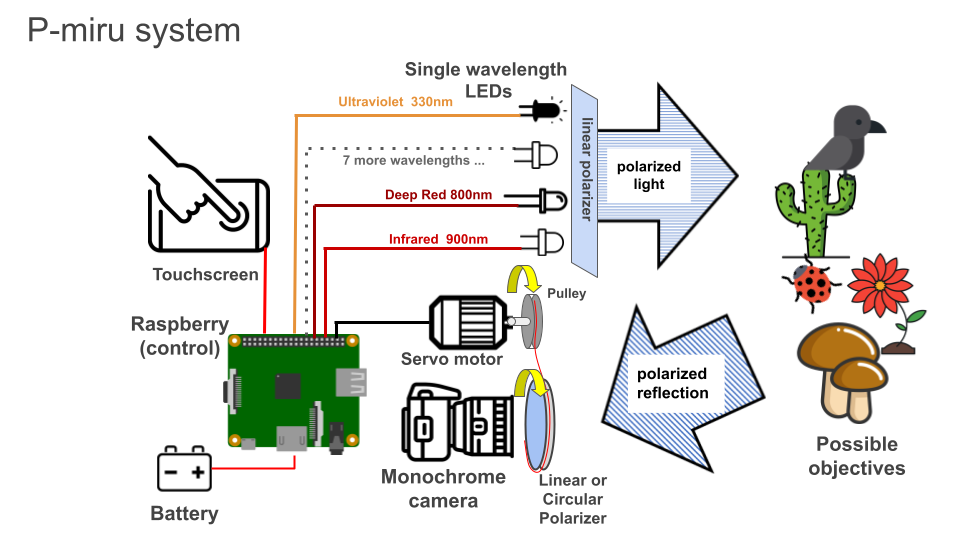
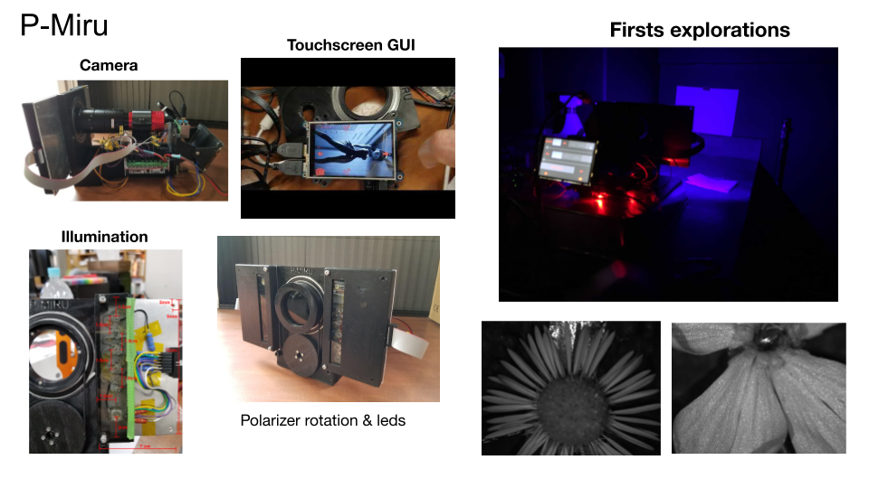
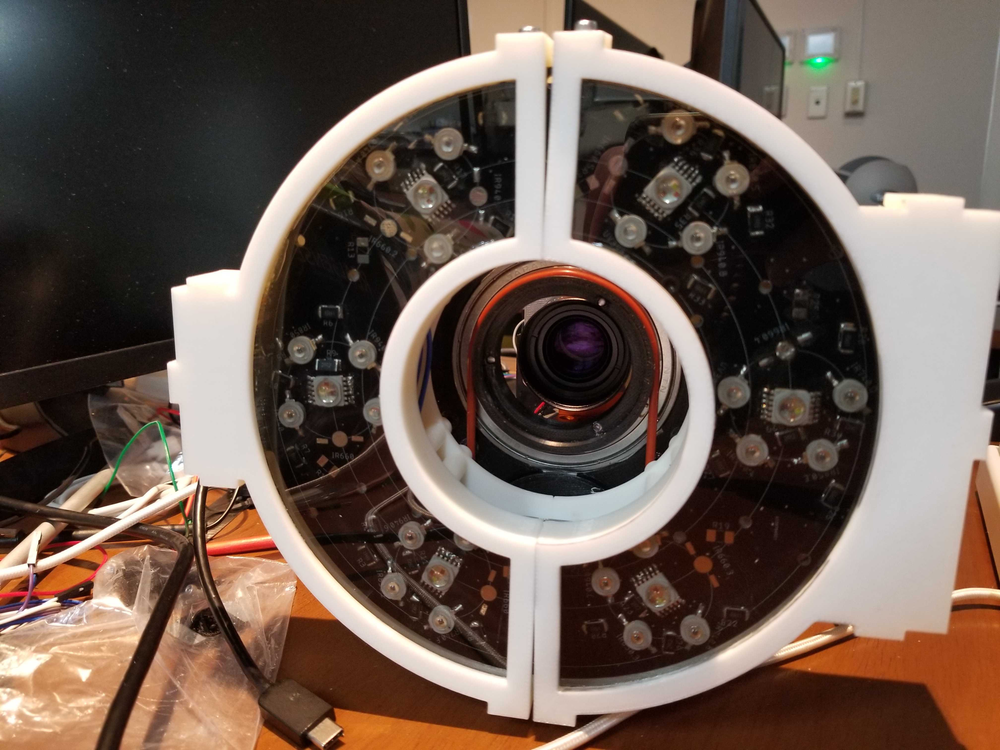
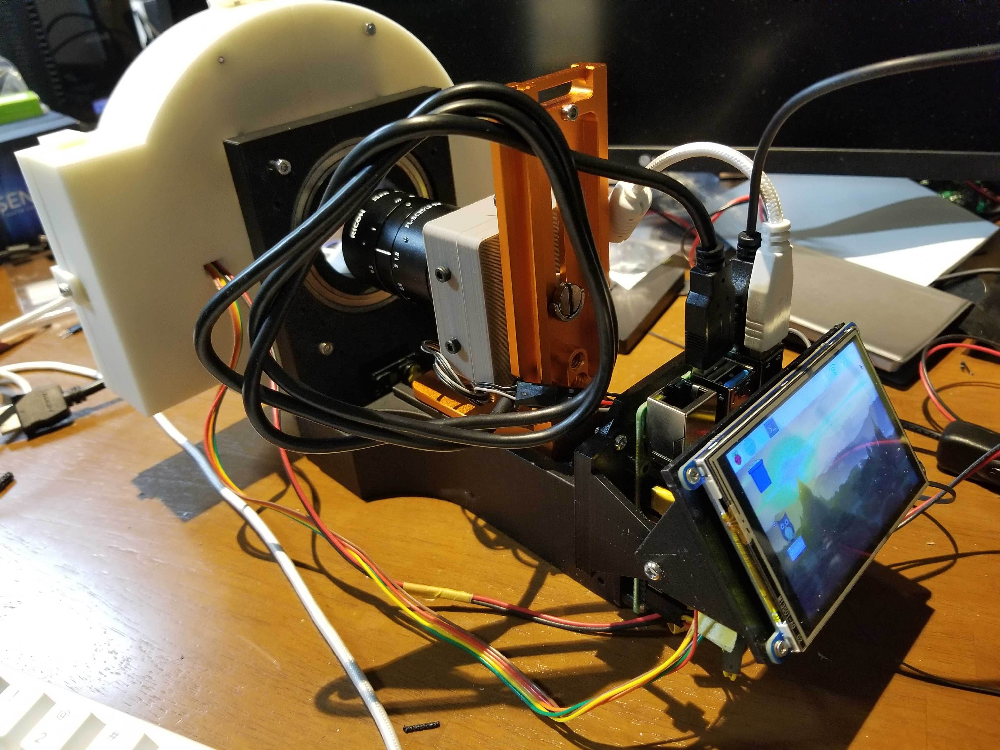
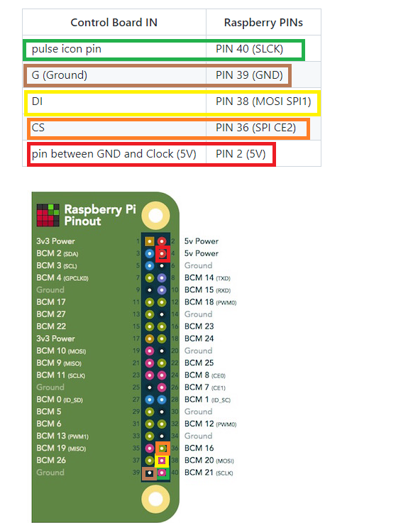

# P-MIRU
An Open Source hyperspectral polarized light camera. 


## System Description



## Actual hardware

### First prototype



### Last prototype

Front 


Back



## User Guide

#### **Turn ON and start the sofware**
To turn ON the camera you must use 2 power supplies. One for the Raspberry and othe other for the LEDs. 
So the transformer with the USB cable goes to the Raspberry. 
The other power supply must be connected to the first control board. This power supply is directly connected with cables.  

#### **Graphical User Interface**
The sofware has 3 diffrent screens.

**Camera screen**


This is the principal screen where you can take pictures and see the camera output. 

**Viewer screen**


In this screen you can navigate that the camera has taken

**Configuration screen**


In this screen, you can configure the Exposure and Gain values of the camera viewer. 
From here you can also execute the auto calibration, to normalize the exposure levels for all the light wavelenghts.

#### **Exposure levels calibration** 
The exposure and gain levels of the camera MUST be calibrated everytime the light conditions change. 
This is step is necessary in order to maintain the same ilumination level for all the illumination wavelenghts. 

To calibrate the exposure levels you need to the following: 
1. Put the camera inside a box, to block other light sources. 

2. Put a blank objective infront of the camera. For this, you can paste a white paper on side of the box the camera is looking. 

3. Turn ON the camera, open the software, go to the Configuration screen and click the "Auto Calibration" button. 

4. Then you have to wait between 10 to 15 minutes. The process takes a long time, please be patient. (you can see the progress of the task next to the "Auto Calibration" button) 

5. After this exposure and gain values of each color are automatically saved in the config.json file. So, this values can be used if the light conditions do not change.  

#### **Use the camera with monitor, keyboard and mouse**
Sometimes is easier to operate the camera with monitor, keyboard and mouse. Just like a PC. 
To do so, BEFORE turning on the camera, connect the monitor using mini HMDI cable. Also connect
a keyboard and mouse to the USB ports. 

( Note. Bluethooth mouse and keyboard are NOT recommended. To many periferals connected to the Raspberry will cause power supply failures, like: slow wifi, slow processor, camera failure.)

Then you have to:

1. Disable the touchscreen input
Then you have to disable the touch commands of the touchscreen. To do so edit the Kivy's config file located in: `/home/pi/PMiru/.kivy/config.ini`. For this you can open the Text Editor from `Menu.. Accesories... Text Editor`. Then find the lines responsible for touch and add a `#` at the beginning to comment them. 
```
[input]
mouse = mouse
#Touchscreen function for 270 degrees orientation
#mtdev_%(name)s = probesysfs,provider=mtdev
#hid_%(name)s = probesysfs,provider=hidinput,param=rotation=270,param=invert_y=1
```
Then save the changes and reboot.

2. Fix the screen orientation
If the image in the monitor is upside down. To flip the image you need to reconfigure the Raspberry monitor output by executing the following commands: 
```
cd /home/pi/
cd Raspberry-Pi-Installer-Scripts
sudo python3 adafruit-pitft.py
```

This will run the touchscreen configuration script. With the keyboard select the following options:
```
[4] [90 degrees] [No] [Yes] and then reboot. 
```
After the reboot the screen in the monitor should be correct. But the image in the touchscreen will be upsidedown. 

#### **Use the camera with touch screen only** 
If you want to use the camera with touchscreen. You must:
1. Enable the touchscreen input
To enable the touch commands of the touchscreen. To do so edit the Kivy's config file located in: `/home/pi/PMiru/.kivy/config.ini`. For this you can open the Text Editor from `Menu.. Accesories... Text Editor`. Then find the lines responsible for touch and erase the `#` at the beginning to uncomment them. 
```
[input]
mouse = mouse
#Touchscreen function for 270 degrees orientation
mtdev_%(name)s = probesysfs,provider=mtdev
hid_%(name)s = probesysfs,provider=hidinput,param=rotation=270,param=invert_y=1
```

2. Fix the screen orientation
If the image in the monitor is upside down. To flip the image you need to reconfigure the Raspberry monitor output by executing the following commands: 
```
cd /home/pi/
cd Raspberry-Pi-Installer-Scripts
sudo python3 adafruit-pitft.py
```

This will run the touchscreen configuration script. With the keyboard select the following options:
```
[4] [270 degrees] [No] [Yes] and then reboot. 
```
After the reboot the screen in the touchscreen should be correct but in the monitor it will be upsidedown. 

#### How to transfer the photos to my PC ?
1. The easiest way is to connect a USB thumbdrive or harddrive to the Raspberry. Then use 
Raspberry file explorer to copy the files from `/home/pi/PMiru/captures` to your external USB drive. 

2. The second method is to copy the files direclty from the SD card. 
Take the SD card from the bottom of the Raspberry PI and insert in your PC.

In Windows you can use Ext2explore ( https://sourceforge.net/projects/ext2read/files/Ext2read%20Version%202.2%20%28Latest%29/ ) to navigate SD card 
and copy the pictures from `/home/pi/PMiru/captures` to your PC. 

### How to update P-Miru from github
The easiest way to update P-Miru software is to do it from the github repository: `https://github.com/java311/PMiru`.

To do it you must open a terminal and type the following commands:
```
cd /home/pi/PMiru
git checkout
git pull origin master
```
Then you will be asked for a login and password. Ask the slack channel to get those.

### Factory Reset
A factory reset **erases all the files in the SD card** and installs PMiru Raspberry image.

1. For this you need to download the **LAST** Raspberry PMiru image file from: https://drive.google.com/drive/folders/1k8Ksq4PHny_fg9CTCQ2_meRpxVSobsXU?usp=sharing 

2. Insert the SD-card of the camera and instert it into your PC.

3. Then Launch the **Raspberry Pi Imager**. You can download and install Raspberry Pi Imager from: https://www.raspberrypi.org/software/ 


4. Select **Use custom** from Choose OS menu. 


5. Select the image file you downloaded. 


6. Select the micro SD card you wish to burn it to. 


7. Click Write and wait. 


8. Once it finish put the SD card back to the camera's Raspberry.  

### How to connect the camera

#### **Touch Screen connections**
The touchscreen must be connected to the Raspberyy using SPI0, 3.3V, 5V, ground and plus touch communication pins.
Here are the PINs configuration: 

| PIN Function  | Raspbery-LCD PIN number |
| ------------- | ------------- |
| 5 Volt   | PIN 2  |
| 3.3 Volt   | PIN 1  |
| SPI0 and COMMs   | PINs 18, 19, 20, 21, 22, 23, 24, 26  |

LCD PIN numbers are the same as the Raspberry. 
Just check the orientation of the LCD PIN slot, it is designed to cover all the Raspberry output pins.


#### **LED PCB donut connections **
The PCB with the donut shape is controled with 2 Amperka boards. This is where the cables from the donut PCB are connected. Then, the boards need to be connected to the Raspberry PINs. 

The first control board must connected to the Raspberry using the following PINs: 
| Control Board IN  | Raspberry PINs |
| ------------- | ------------- |
| pulse icon pin   | PIN 40  (SLCK) |
| G (Ground) | PIN 39 (GND)  |
| DI   | PIN 38 (MOSI SPI1) |
| CS   | PIN 36 (SPI CE2) |
| pin between GND and Clock (5V)   | PIN 2 (5V) |




Then the fist board OUT must connected the the second control board IN.
To connect them togheter, just connect the SPI OUT of the first board to the same PINS on the SPI IN pins of the second board. 

| First board OUT  | Second board IN |
| ------------- | ------------- |
| Pulse icon pin   | Pulse icon pin (SLCK) |
| G (Ground) | G (Ground)  |
| pin between GND and Clock (5V) | pin between GND and Clock (5V) |
| DI (MOSI) | DI (MOSI) |
| CS (CS)  | CS (CS) |

Inside the donut the LEDs can be connected in any other to the two boards. The order in which you want to controll then can be defined in the `config.json` file. 

#### **Motor connections**
The motor gets power from the second board, but it is controlled directly from the Raspberry. 
So, it must be connected the following way: 

| Motor  | Connection |
| ------------- | ------------- |
| 5 Volt   | Control board 2 PIN between CS and GND |
| Ground   | COntrol board 2 GND PIN |
| Comm    | Raspberry PIN 32 (PWM0)  |

#### **Camera connection**
The camera is connected using a USB 2 or USB 3 cable. 
Even your grandpa can do this...

### How to edit the config.json file 
TODO 

### Troubleshooting

#### **The software got freezed**
If the software got freezed for a very long time. You can close it by pressing Ctrl + C in the terminal window (The terminal window is the black screen that opens with P-Miru)

If you are just using the touch screen you can close the window by using Xkill. 
Xkill is an application that lets you "kill" or close any graphical app in Linux. 
Open it from, the main menu, others and Xkill. Then just click directly to PMiru screen. 

#### **The program freeze or stoped and the LEDs are ON**
Please DO NOT allow this to happen. This can harm the LEDs. To turn OFF the LEDs, just open P-Miru again and the LEDs will turn OFF. 

#### **The autocalibration gets stuck in a single LED for a long time ( more than 20 min)**
This means that the camera is not receving enough light from the LED. 
This happend frequenctly with the UV LED (320nm or LED #7). 

To solve the problem you must improve the light conditions in your setup. Maybe it would be necessary to approach the camera to the objective. 
Another solution, could be to avoid the usage of this light by editing Pmiru's `config.json` file.  

#### **When taking photos the progress bar restarts several times** 
That is normal. After all the photos are taking the camera also create the stacked tiff files for each wavelenght. 
This could take even longer than the capture process. If you do not want to use stacked tiff files, you can edit Pmiru's `config.json` file. 


 